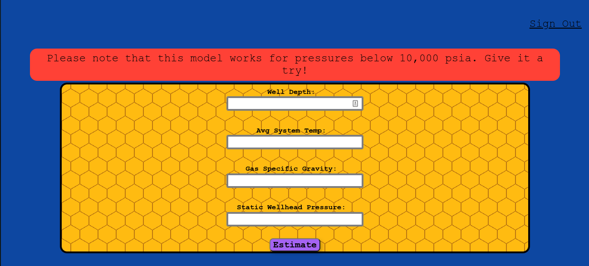

  <h2><b>Estimate-SBHP</b></h2>

<!-- PROJECT DESCRIPTION -->
# 📖 Estimate-SBHP 

    This is my Final Year undergraduate project in partial fulfilment for the award of Bachelor of Engineering Degree in Chemical Engineering.
    During one of our lectures in the first semester Fourth Year, I learnt Natural Gas Engineering. Of the many methods of predicting/estimating static bottom hole pressure, I discovered that Sukkar and Cornell is widely used both for vertical and inclined wells especially for pressures below 10,000psia. 
    This model is made to relief reservoir engineers(or student engineers) who which to predict SBHP with the Sukkar and Cornell approach. This model has 98% accuracy as compared to the measured SBHP(with gauge). It is made to extrapolate and interpolate values to obtain best pseudo reduced wellhead pressure value, and carry out all the possible iterations involved in the calculation automatically.
    It is a light weight application built with Python3-Flask(backend) and React-Vite(frontend).
    

 

# 🛠 Built With 

### Tech Stack 

- Python3
- Flask
- React-Vite
- Pandas
- NumPy
 

## Requirements
This Application requires:

**_Python (>= 3.9)_** 
**_numpy==1.23.2_** 
**_pandas==1.4.3_**  
**_Flask==3.0.0_** 
**_React-Vite_** 

See [Requirements](./server/requirements.txt) for details.

## <h2>Usage</h2>:

Visit the website at https://..................

<h2>Set your Environment Variables Below:</h2>

1. export SECRET_KEY=set to any random alphanumeric character or use python built-in `from uuid import uuid4()` to generate any random values 
2. export DB_PASSWORD = Betini2024
3. export REDIS_URL=redis://localhost:6379

<h2>Application and usage on the local machine</h2>

To use this application locally, follow the steps below: 
1.  Open the terminal or command prompt 
2.  git clone `<repo url>` 
3.  cd Estimate-SBHP 
4.  cd server 
5.  python3 views.py (use Postman to test the APIs) 
6.  cd client 
7.  npm install 
8.  npm run dev 
9.  visit `htpp://localhost:5173`

<h2>Application and usage Overview</h2>

  

Login Page

    

  

  

Home Page

    

  

  

Resutls Page

    

  

  

## Files :pencil:

| Property | Description |
|------|-------------|
| [server](./server) | Directory |
| [client](./client) | Directory |
| [README.md](./README.md) | File |

## Author

- Github: [betiniakarandut](https://www.github.com/betiniakarandut)
- LinkedIn: [betini-akarandut](https://www.linkedin.com/in/betini-akarandut-24654321a)
- Tweeter: [@betiniakarandut](https://twitter.com/betiniakarandut)
